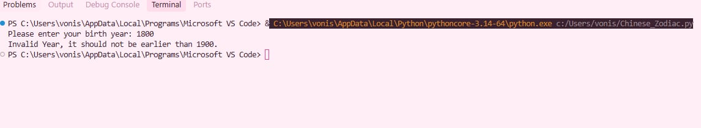

# Chinese Zodiac Sign Finder

## Requirements
Create a Python program that determines a user's Chinese Zodiac sign based on their birth year.
- The program should ask the user to input their birth year.
- It should validate that the year is not earlier than 1900, and display an error message if it is.
- Using the valid year, the program should calculate the correct zodiac sign using the formula `(year - 1900) % 12` and display the result.

## Code

```python
#Function for grouping all of the code

def zodiac():

    #This is the list of the Chinese Zodiac signs
    
    zodiac_sign = ['Rat (鼠/Shū)' ,
    'Ox ("牛/ Niú")' ,
    'Tiger (虎/Hǔ)',
    'Rabbit (免/Tù)' ,
    'Dragon (龙 / Lóng)' ,
    'Snake (蛇/ Shé)' ,
    'Horse (무 / Mă)' ,
    'Goat (/Yáng)' ,
    'Monkey (猴/Hóu)' ,
    'Rooster (鸡/JT)' ,
    'Dog (狗/Gõu)' ,
    'Pig (猪 / Zhū)'
    ]

    #This will ask the user's input of their birth year
   
    x = int(input("Please enter your birth year: "))
    if x < 1900:
        print("Invalid Year, it should not be earlier than 1900.")

    #Return is needed here because it will stop different messeges getting mixed up
   
        return

    #This is the formula whose function is to find the proper index in the list for the user's input
   
    y = (x -1900) % 12
    print(f"Your Chinese Zodiac Sign is: {zodiac_sign[y]}")

    #Returns the x back out of the function
   
    return x

    #Calls the fuctions and stores whatever is the value of x

x = zodiac()
```

## Output Screenshot


